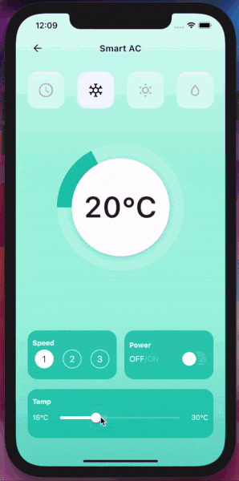

# Draw a circular control with CustomPainter in Flutter

Learn how to use Flutter CustomPainter to beautify the UI of your next application.

Link to my tutorial tutorial

- [Blog tutorial]() - Draw a circular control with CustomPainter in Flutter
